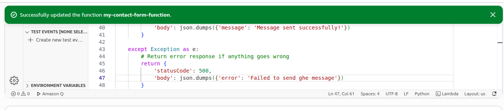
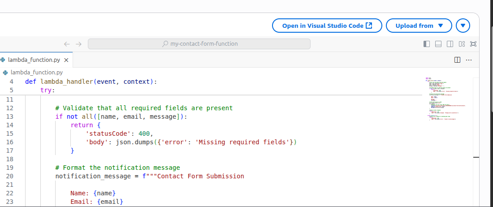
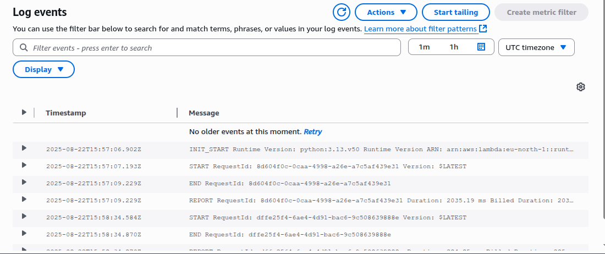

# 🚀 My AWS Builder Journey – Cloud Launch Challenge 1  

*Tag: cloud-launch-challenge-1*  

## 🌐 Live Website  
👉 [Visit my project here](https://main.dscruezgwt4xm.amplifyapp.com)  

This is the live version of the website I deployed using **AWS Amplify**. It’s simple, functional, and demonstrates how cloud services can make deploying projects seamless.  

---

## 🛠️ What I Added / Changed from the Template  

The basic template gave me a starting point, but I wanted my project to feel more **personal and practical**. Here’s what I changed:  

- Customized the **layout and styling** to better match my vision.  
- Integrated **a dynamic products section** that updates automatically.  
- Configured **CORS and API Gateway** so my frontend communicates securely with a Lambda backend.  
- Added **deployment automation** so every new commit pushes changes directly to my Amplify-hosted site.  

---

## 📖 My Daily Learnings & Aha! Moments  

### **Day 1 – Setup & First Deployment**  
- Learned how easy it is to connect GitHub with **AWS Amplify**.  
- My “aha!” moment: seeing my first commit instantly trigger a new build and deploy.  

### **Day 2 – Backend Services (Lambda + API Gateway)**  
- Built a simple **Lambda function** and exposed it using an **API Gateway Function URL**.  
- Learned about configuring **CORS policies** to allow my frontend to call the backend.  
- “Aha!”: Realized how **serverless removes the headache of managing servers**—just code and deploy.  

### **Day 3 – Personalization & Debugging**  
- Customized the UI to reflect my style.  
- Debugged CORS errors (common challenge!) by adjusting allowed origins to my Amplify domain.  
- “Aha!”: Cloud troubleshooting is about **reading logs carefully**—CloudWatch saved me.  

### **Day 4 – Enhancements & Final Touches**  
- Added more polish to the frontend.  
- Tested the full workflow: user request → API Gateway → Lambda → response in frontend.  
- “Aha!”: The **speed of serverless + Amplify** makes it realistic to prototype quickly.  

---

## 📸 Screenshots of My AWS Services in Action  

Here are some highlights of my build process:  

-   
-   
-   

---

## 💡 Tips for Future Builders  

1. **Start small** – Don’t try to build everything at once. Deploy a basic version and improve daily.  
2. **Check your CORS settings early** – Most frontend-backend issues come from here.  
3. **Use CloudWatch logs** – Debugging Lambda without logs is like walking blind.  
4. **Automate deployments** – Connect Amplify to GitHub so every push deploys your updates.  
5. **Experiment fearlessly** – AWS free tier is generous; try services beyond Amplify and Lambda.  

---

## 🎉 Final Thoughts  

This challenge gave me a practical path to explore **serverless, Amplify hosting, and API integrations**. Each day came with unique learnings, but the biggest win was understanding how all AWS services fit together in a real-world project.  

I’m excited to keep building and exploring more advanced use cases with AWS!  

👉 Once again, here’s the live project: [https://main.dscruezgwt4xm.amplifyapp.com](https://main.dscruezgwt4xm.amplifyapp.com)  

google-site-verification=FMN29ofqnfTaUUefp9pinmUyuSosblbt5QuITezJiIw